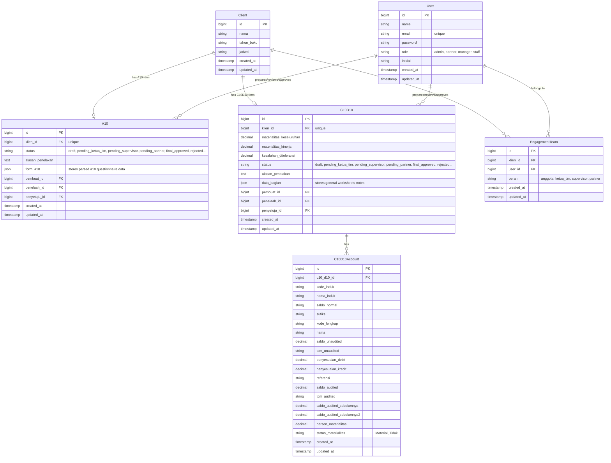

# Auditra

**Never manage audit approvals manually again.**

Have you ever struggled with tracking audit documents, handling manual review flows, and ensuring compliance across multiple stakeholders?

**Auditra** helps you automate, parse, review, and approve audit forms (specifically the A10 Pre-Engagement forms) seamlessly through an interactive wizard and a multi-tier role-based approval dashboard.

## Live Demo

(Link will be available upon deployment)

## Preview

### Welcome Page


### Dashboard Overview


### Form Prefill (A10)


## What It Does

- **A10 Pre-Engagement Wizard** → Multi-step interactive wizard to create, edit, and evaluate client acceptance and continuance forms (SA 210, Going Concern, Integrity, and Independence).
- **D10 Materiality & Significant Accounts** → Interactive materiality calculator (Overall Materiality, Performance Materiality, Tolerable Error) and mapping of Significant Accounts with audit assertions.
- **C10 Worksheets & Trial Balance** → Input and adjustments spreadsheet interface to record normal balances, audited/unaudited amounts, and dynamically calculate materiality thresholds.
- **Read-Only Preview Modal** → Let reviewers (Ketua Tim, Supervisor, Partner) view detailed audit forms (A10 and D10) in an interactive read-only modal directly from their dashboard queues.
- **Multi-Tier Role-Based Workflow** → Comprehensive dashboard mapping approval flows through Anggota, Ketua Tim, Supervisor, and Partner roles.
- **Review & Feedback Loop** → Rejection capability with detailed reason feedback, allowing Anggota to correct and resubmit drafts.
- **Traceable Log** → Transparent log tracking of preparer, reviewer, and final approver details for each audit form.

## How It Works

### 1. Form Generation & Initialization
- **A10**: Anggota starts the A10 Pre-Engagement wizard for the selected client and fills out details.
- **D10 & C10**: Anggota starts the D10/C10 planning materiality wizard for the selected client and fills out calculations.

### 2. Form Editing & Submission
- Anggota fills out and saves the multi-step form as a draft.
- Once finished, the Anggota submits the form for review, which locks editing and sets the status to `pending_ketua_tim`.

### 3. Verification & Decision by Ketua Tim
- Ketua Tim reviews the form in their dashboard queue and can either approve (escalating to `pending_supervisor`) or reject (returning status to `rejected` with feedback notes).

### 4. Verification by Supervisor
- Supervisor checks the escalated form and can either approve (escalating to `pending_partner`) or reject (returning to `rejected`).

### 5. Final Sign-off by Partner
- Partner performs final validation and signs off on the form, updating the status to `final_approved`.

## Key Features

### Multi-Role Authorization
- Strict RBAC using custom Laravel Middleware (`role`).
- Role-specific dashboards hiding or showing administrative tools depending on authorization levels.

### Overlapping ID Resolution (Form Type Dispatching)
- Standardized controller request handling that reads the `form_type` dynamically during review, submission, and viewing actions.
- Resolves routing collision between `a10` and `c10_d10` database records where auto-incremented primary keys overlap (e.g., A10 ID 1 and C10/D10 ID 1).

### Dynamic React Wizards
- Multi-step interactive wizards using Inertia.js and Headless UI.
- Real-time client-side validations and field mapping for complex section data.
- Responsive layout with desktop table views and mobile card lists.
- **Ownership & Capital Calculation**: Robust error handling that dynamically catches empty ownership lists or empty capital values to prevent division by zero errors (`#DIV/0!`), presenting a clean hyphen (`'-'`) placeholder instead.
- **Enhanced Form A10 UI/UX**:
  - Clean initial state without hardcoded default dates (`'4/25/2024'`) or initials (`'SP'`).
  - Standardized short input placeholders (e.g., `"DD/MM/YYYY"` for dates).
  - Clean default fields without rigid auto-filled strings (e.g. `"Jasa Yang Akan Diberikan"` defaults to `''` instead of dummy values).
  - Consistent boxed designs for inputs (such as matching border and background styles for initials and date inputs).
  - Smooth interactive transitions with focus rings (`focus:ring-2 focus:ring-blue-500/20`) and active scale-down feedback for buttons (`active:scale-[0.99]` and `active:scale-[0.98]`).
  - Standard compliance opening paragraphs for Section III (Integritas Manajemen) and Section IV (Independensi Kantor).

### Structured JSON Storage
- Audit forms data structured into detailed JSON objects (`section_data` / `data_bagian`) and stored inside database fields utilizing array/JSON casts.
- Flexibility to accommodate different sections of standard worksheets without database migration overhead.

## Project Architecture

```
auditra/
├── app/                        # Backend Application Core
│   ├── Http/
│   │   ├── Controllers/
│   │   │   ├── AuditFormController.php # Core workflow, state updates, and submissions
│   │   │   ├── ProfileController.php   # User profile management controller
│   │   │   └── UserController.php      # User management controller (Admin panel)
│   │   └── Middleware/
│   │       └── RoleMiddleware.php      # Role-based access control router filter
│   ├── Models/
│   │   ├── A10.php             # A10 Pre-Engagement Eloquent Model & JSON casts
│   │   ├── C10D10.php          # C10/D10 Materiality & Worksheets Eloquent Model & JSON casts
│   │   ├── C10D10Account.php   # Trial balance sub-accounts and materiality settings Eloquent Model
│   │   ├── Client.php          # Client company details Eloquent Model
│   │   ├── EngagementTeam.php  # Maps users to specific client's engagement team (tim_perikatans table)
│   │   └── User.php            # User Model with helper methods for roles
│   └── Services/
│       └── OdsParser.php       # Low-level XML-based ODS parser service (legacy)
│
├── bootstrap/                  # Framework bootstrapping & route configuration
│
├── config/                     # Application-wide configuration files
│
├── database/                   # Database files
│   ├── migrations/             # Schema definitions (Users, Cache, Clients, Tim Perikatans, A10, C10D10, C10D10Accounts)
│   ├── seeders/
│   │   └── DatabaseSeeder.php  # Database seeding for roles, users, clients, perikatans, and draft A10/C10/D10 forms
│   └── form_approval_db.sql    # Exported database dump SQL file for local development
│
├── docs/                       # Technical guide
│
├── routes/                     # Application routing definitions
│   ├── web.php                 # Core web and role-protected workflow routes
│   └── auth.php                # Authentication routes (Laravel Breeze)
│
├── resources/                  # Frontend Assets & React Application
│   ├── js/
│   │   ├── Components/             # React components (Form inputs, UI elements)
│   │   │   ├── AuditFormWizard.jsx # Multi-step A10 wizard component
│   │   │   ├── AuditFormC10Wizard.jsx # C10 Worksheet wizard component
│   │   │   └── AuditFormD10Wizard.jsx # D10 Materiality wizard component
│   │   ├── Pages/                  # Page view components
│   │   │   ├── AuditForm/
│   │   │   │   └── Edit.jsx        # Edit form page wrapper
│   │   │   ├── Dashboard.jsx       # Role-customized application dashboard
│   │   │   └── Welcome.jsx         # Landing page view
│   │   └── app.jsx                 # React/Inertia frontend entry point
│   └── css/
│       └── app.css             # Base styles & tailwind configurations
│
├── public/                     # Publicly exposed static assets
│
├── package.json                # Frontend package dependencies (Vite, Tailwind, Inertia)
├── composer.json               # Backend composer dependencies (Laravel, Breeze, Sanctum)
├── vite.config.js              # Vite compiler configuration
└── README.md                   # System documentation
```

## Database Schema

Auditra uses a relational database structure designed to manage user authentication, role-based access control (RBAC), and audit form approval workflows. Below is a detailed explanation of the tables and their relationships.

### Database Relationship Diagram



### Table Definitions

#### 1. `users` Table
Stores user accounts and their respective roles inside the system.
* **`id`** (`unsigned big integer`, Primary Key): Unique identifier for each user.
* **`name`** (`string`): Full name of the user.
* **`email`** (`string`, Unique): Email address used for authentication.
* **`password`** (`string`): Hashed password.
* **`role`** (`string`, Default: `'staff'`): The global system role defining administrative permission levels. Available values: `admin`, `partner`, `manager`, `staff`.
* **`inisial`** (`string`): Short initials (e.g. `'AND'`, `'SAN'`).
* **`created_at` / `updated_at`** (`timestamp`): Auto-managed Laravel timestamps.

#### 2. `clients` Table
Stores company details of the clients being audited.
* **`id`** (`unsigned big integer`, Primary Key): Unique identifier for each client.
* **`nama`** (`string`): Name of the client company.
* **`tahun_buku`** (`string`): Financial audit year book (e.g., `'31 Desember 2024'`).
* **`jadwal`** (`string`): Current scheduling phase for the client's audit.

#### 3. `tim_perikatans` Table
Maps users as members of a specific client's engagement team.
* **`id`** (`unsigned big integer`, Primary Key): Unique identifier.
* **`klien_id`** (`unsigned big integer`, Foreign Key -> `clients.id`): References the client.
* **`user_id`** (`unsigned big integer`, Foreign Key -> `users.id`): References the user.
* **`peran`** (`string`): Role in the client's audit team (`anggota`, `ketua_tim`, `supervisor`, `partner`).

#### 4. `a10` Table
Stores the A10 Pre-Engagement forms, their workflow approval statuses, and parsed questionnaire data.
* **`id`** (`unsigned big integer`, Primary Key): Unique identifier.
* **`klien_id`** (`unsigned big integer`, Foreign Key -> `clients.id`, Unique): References the client.
* **`status`** (`string`, Default: `'draft'`): Current workflow approval state (`draft`, `pending_ketua_tim`, `pending_supervisor`, `pending_partner`, `final_approved`, `rejected_ketua_tim`, `rejected_supervisor`, `rejected_partner`).
* **`alasan_penolakan`** (`text`, Nullable): Text containing review rejection feedback.
* **`form_a10`** (`json`): Stores the entire detailed audit questionnaire answers.
* **`pembuat_id`** (`unsigned big integer`, Foreign Key -> `users.id`): References the preparer.
* **`penelaah_id`** (`unsigned big integer`, Foreign Key -> `users.id`, Nullable): References the reviewer.
* **`penyetuju_id`** (`unsigned big integer`, Foreign Key -> `users.id`, Nullable): References the final approver.

#### 5. `c10_d10` Table
Stores the planning materiality calculations and metadata shared by C10 (Worksheets) and D10 (Materiality).
* **`id`** (`unsigned big integer`, Primary Key): Unique identifier.
* **`klien_id`** (`unsigned big integer`, Foreign Key -> `clients.id`, Unique): References the client (one record per client).
* **`materialitas_keseluruhan`** (`decimal`): Overall Materiality threshold.
* **`materialitas_kinerja`** (`decimal`): Performance Materiality threshold.
* **`kesalahan_ditoleransi`** (`decimal`): Tolerable Error threshold.
* **`status`** (`string`, Default: `'draft'`): Current workflow approval state (shared by C10 and D10).
* **`alasan_penolakan`** (`text`, Nullable): Rejection feedback for the C10/D10 forms package.
* **`data_bagian`** (`json`): Stores general notes and worksheets metadata.
* **`pembuat_id`**, **`penelaah_id`**, **`penyetuju_id`** (`unsigned big integer`, Foreign Keys -> `users.id`): User tracking columns for the workflow.

#### 6. `c10_d10_accounts` Table
Stores the trial balance sub-accounts and materiality settings associated with the client's worksheets.
* **`id`** (`unsigned big integer`, Primary Key): Unique identifier.
* **`c10_d10_id`** (`unsigned big integer`, Foreign Key -> `c10_d10.id`): References the parent C10/D10 form.
* **`kode_induk`** / **`nama_induk`** (`string`): Parent account group info.
* **`saldo_normal`** (`string`): `'debit'` or `'kredit'`.
* **`sufiks`** / **`kode_lengkap`** / **`nama`** (`string`): Account identification.
* **`saldo_unaudited`** / **`saldo_audited`** / **`saldo_audited_sebelumnya`** (`decimal`): Balance sheets columns.
* **`penyesuaian_debit`** / **`penyesuaian_kredit`** (`decimal`): Audit adjustments.
* **`persen_materialitas`** (`decimal`) / **`status_materialitas`** (`string`): D10 Planning parameters.

## Database Import & Export Guide

The project includes an exported database dump located at [form_approval_db.sql](file:///d:/work/auditra/database/form_approval_db.sql). You can use this file to quickly seed or restore your MySQL database with existing data (clients, roles, team memberships, and forms).

### How to Import the Database Dump

#### Option 1: Command Line (CLI)
Open your terminal (PowerShell or Command Prompt) and run:
```bash
mysql -u your_username -p your_database_name < database/form_approval_db.sql
```
For example, if your MySQL user is `root` and the database is `form_approval_db`:
```bash
mysql -u root -p form_approval_db < database/form_approval_db.sql
```
> [!NOTE]
> If you get a `'mysql' is not recognized as an internal or external command` error, it means MySQL is not in your system's PATH environment variable. You can run the command using the absolute path to your MySQL installation, for example:
> ```powershell
> & "C:\xampp\mysql\bin\mysql.exe" -u root -p form_approval_db < database/form_approval_db.sql
> ```
> *(Adjust the path to match where your XAMPP, Laragon, or local MySQL is installed.)*

#### Option 2: Database GUIs (Recommended)
You can import the SQL file using graphical tools like TablePlus, DBeaver, HeidiSQL, phpMyAdmin, or Navicat:
1. Create a MySQL database named `form_approval_db`.
2. Connect to the database using your tool of choice.
3. Open and execute the SQL script file `database/form_approval_db.sql`.

---

### How to Export / Backup Your Database

To export your current local database back to the `database` folder, use `mysqldump`:
```bash
mysqldump -u your_username -p your_database_name > database/form_approval_db.sql
```
> [!NOTE]
> If `mysqldump` is not in your PATH, call it directly from its directory:
> ```powershell
> & "C:\xampp\mysql\bin\mysqldump.exe" -u root -p form_approval_db > database/form_approval_db.sql
> ```

## Technology Stack

### Backend
- **Laravel Framework** → Core backend PHP MVC framework
- **Inertia.js** → Connects Laravel backend and React frontend without building a separate API
- **MySQL / SQLite** → Relational database for persistent storage

### Frontend
- **React.js** → Core library for building interactive user interfaces
- **Tailwind CSS** → Utility-first CSS styling framework
- **Headless UI** → Unstyled, accessible UI components for React
- **Axios** → HTTP client for file uploads and JSON requests

### Build Tools & Version Control
- **Vite** → Fast frontend development server and compiler
- **Composer** → PHP package dependency manager
- **NPM** → Node.js package manager

## Quick Start

### 1. Clone Repo
```bash
git clone https://github.com/Falrlz/auditra.git
cd auditra
```

### 2. Setup Environment
Set up your database details inside `.env` (the copy from `.env.example` is handled automatically during setup, but database configurations must be adjusted manually).

### 3. Import Seed Database
Import the pre-seeded dump file `database/form_approval_db.sql` to your local MySQL database using the instructions in the **Database Import & Export Guide** above.

Alternatively, if you prefer to start with a fresh database, run standard migrations:
```bash
php artisan migrate --seed
```

### 4. Run Application Setup
Automates Composer installs, environment file setups, key generation, database migrations, NPM installs, and frontend building:
```bash
composer run setup
```

### 5. Start Development Servers
Starts the Laravel server, queue listener, tail log listener, and Vite compiler concurrently:
```bash
composer run dev
```

### Pre-seeded User Accounts
For testing the role-based dashboard views and multi-tier approval flows, you can log in using the following accounts:
- **Admin**: `linda@example.com` (Password: `password`, Initial: `LIN`) - Global administrator (can manage all users and clients).
- **Partner**: `sandra@example.com` (Password: `password`, Initial: `SAN`) - Partner role (can configure client engagement teams).
- **Supervisor / Manager**: `joko@example.com` (Password: `password`, Initial: `JOK`) - Supervisor role in the client engagement team (handles supervisor-level approvals).
- **Ketua Tim**: `saipul@example.com` (Password: `password`, Initial: `SAI`) - Ketua Tim role in the client engagement team (handles team-leader-level approvals).
- **Anggota / Staff**: `andi@example.com` (Password: `password`, Initial: `AND`) - Anggota role in the client engagement team (creates, edits, and submits A10/D10 forms).

## Environment Configuration

```env
DB_CONNECTION=mysql
DB_HOST=127.0.0.1
DB_PORT=3306
DB_DATABASE=form_approval_db
DB_USERNAME=root
DB_PASSWORD=
```

## Acknowledgements

This project utilizes open standard libraries and frameworks:

- **Laravel Framework & Breeze Starter Kit**  
  For supplying robust authentication templates, routing middleware, and DB ORM layers.
- **Inertia.js & React Core Teams**  
  For enabling cohesive single-page application experiences directly integrated into Laravel.

## Disclaimer

- This project is intended for administrative audit flow management and evaluation purposes.
