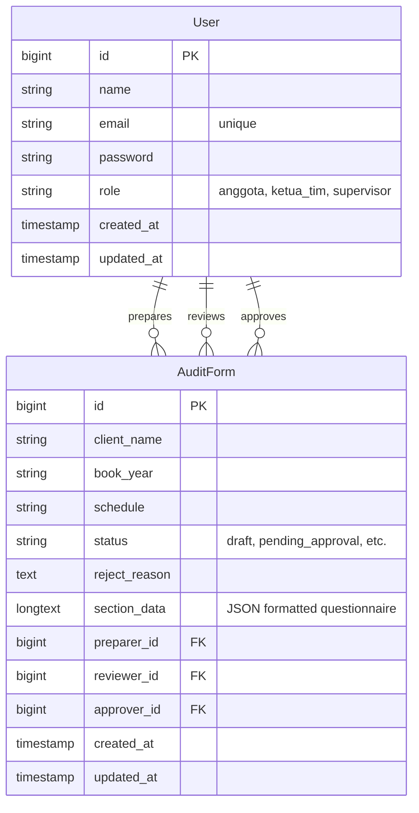

# Auditra

**Never manage audit approvals manually again.**

Have you ever struggled with tracking audit documents, handling manual review flows, and ensuring compliance across multiple stakeholders?

**Auditra** helps you automate, parse, review, and approve audit forms (specifically the A10 Pre-Engagement forms) seamlessly through an interactive wizard and a multi-tier role-based approval dashboard.

## Live Demo

(Link will be available upon deployment)

## Preview

### Welcome Page


### Dashboard Overview


### Form Prefill (A10)


## What It Does

- **Audit Form Wizard** → Multi-step wizard to create and edit detailed A10 audit forms  
- **ODS File Parser** → Instantly pre-fill complex audit forms from an uploaded `a10.ods` file  
- **Role-Based Workflows** → Dynamic features and views tailored specifically for Anggota, Ketua Tim, and Supervisor roles  
- **Review & Feedback Loop** → Rejection capability with detailed reasons, allowing Anggota to correct and resubmit drafts  
- **Traceable Log** → Transparent tracking of preparer, reviewer, and final approver details for each audit form  

## How It Works

### 1. Form Generation & ODS Upload
- Anggota uploads an `a10.ods` spreadsheet or manually starts the wizard.
- The `OdsParser` service extracts XML content from the ODS package and parses cell values.
- Form fields are dynamically pre-filled with structured data mapped from the spreadsheet rows.

### 2. Form Editing & Submission
- Anggota fills out and saves the multi-step form (SA 210, client background, going concern, integrity, independence, and conclusions) as a draft.
- The completed form is submitted, updating its status to `pending_approval`.

### 3. Verification & Decision by Ketua Tim
- Ketua Tim checks the submitted form in their dashboard queue.
- Ketua Tim can either approve (escalating the status to `approved_by_leader`) or reject (returning the status to `rejected` with custom feedback notes).

### 4. Final Sign-off by Supervisor
- Once approved by the Ketua Tim, the form enters the Supervisor's approval queue.
- Supervisor signs off, changing the status to `approved` and completing the approval cycle.

## Key Features

### Multi-Role Authorization
- Strict RBAC using custom Laravel Middleware (`role`).
- Role-specific dashboards hiding or showing administrative tools depending on authorization levels.

### Dynamic React Wizard
- Multi-step interactive wizard using Inertia.js and Headless UI.
- Real-time client-side validations and field mapping for complex section data.
- Responsive layout with desktop table views and mobile card lists.

### Structured JSON Storage
- Audit forms data structured into detailed JSON objects (`section_data`) and stored inside a single Eloquent field utilizing database casts.
- Flexibility to accommodate different sections of standard Pre-Engagement sheets without database migration overhead.

### Automated ODS Processing
- Custom ZIP & XML parser implementation (`OdsParser`) without external heavyweight spreadsheet library dependencies.
- Translates sheet structure directly to application state variables.

## Project Architecture

```
auditra/
├── app/                        # Backend Application Core
│   ├── Http/
│   │   ├── Controllers/
│   │   │   ├── AuditFormController.php # Core workflow, state updates & ODS parsing
│   │   │   └── ProfileController.php   # User profile management controller
│   │   └── Middleware/
│   │       └── RoleMiddleware.php      # Role-based access control router filter
│   ├── Models/
│   │   ├── AuditForm.php       # AuditForm Eloquent Model & JSON casts
│   │   └── User.php            # User Model with helper methods for roles
│   └── Services/
│       └── OdsParser.php       # Low-level XML-based ODS parser service
│
├── bootstrap/                  # Framework bootstrapping & route configuration
│
├── config/                     # Application-wide configuration files
│
├── database/                   # Database files
│   ├── migrations/             # Schema definitions (Users, Cache, AuditForms)
│   └── seeders/
│       └── DatabaseSeeder.php  # Database seeding for roles, users, and draft A10 form
│
├── docs/                       # Technical guide
│
├── routes/                     # Application routing definitions
│   ├── web.php                 # Core web and role-protected workflow routes
│   └── auth.php                # Authentication routes (Laravel Breeze)
│
├── resources/                  # Frontend Assets & React Application
│   ├── js/
│   │   ├── Components/             # React components (Form inputs, UI elements)
│   │   │   └── AuditFormWizard.jsx # Multi-step A10 wizard controller
│   │   ├── Pages/                  # Page view components
│   │   │   ├── Dashboard.jsx       # Role-customized application dashboard
│   │   │   └── Welcome.jsx         # Landing page view
│   │   └── app.jsx                 # React/Inertia frontend entry point
│   └── css/
│       └── app.css             # Base styles & tailwind configurations
│
├── public/                     # Publicly exposed static assets
│
├── package.json                # Frontend package dependencies (Vite, Tailwind, Inertia)
├── composer.json               # Backend composer dependencies (Laravel, Breeze, Sanctum)
├── vite.config.js              # Vite compiler configuration
└── README.md                   # System documentation

## Database Schema

Auditra uses a relational database structure designed to manage user authentication, role-based access control, and audit form approval workflows. Below is a detailed explanation of the primary tables and their relationships.

### Database Relationship Diagram



### Table Definitions

#### 1. `users` Table
Stores user accounts and their respective role inside the system.
* **`id`** (`unsigned big integer`, Primary Key): Unique identifier for each user.
* **`name`** (`string`): Full name of the user.
* **`email`** (`string`, Unique): Email address used for authentication.
* **`password`** (`string`): Hashed password.
* **`role`** (`string`, Default: `'anggota'`): The system role defining permission levels. Available values:
  * `anggota`: Staff members who prepare the audit forms and parse ODS documents.
  * `ketua_tim`: Team leaders responsible for the initial review step (can approve or reject).
  * `supervisor`: Supervisors who provide the final approval.
* **`created_at` / `updated_at`** (`timestamp`): Auto-managed Laravel timestamps.

#### 2. `audit_forms` Table
Stores the audit forms, their workflow approval statuses, and parsed questionnaire data.
* **`id`** (`unsigned big integer`, Primary Key): Unique identifier for the audit form.
* **`client_name`** (`string`): The name of the client company (e.g. `PT EASTPARC HOTEL TBK`).
* **`book_year`** (`string`): Financial year ending date under audit (e.g. `31 Desember 2024`).
* **`schedule`** (`string`): The engagement stage name.
* **`status`** (`string`, Default: `'draft'`): Current workflow approval state:
  * `draft`: Form is being filled or parsed by `anggota` and not yet submitted.
  * `pending_approval`: Submitted by `anggota` and waiting for review by `ketua_tim`.
  * `approved_by_leader`: Reviewed and approved by `ketua_tim`, waiting for final sign-off by `supervisor`.
  * `approved`: Fully approved by `supervisor` (final state).
  * `rejected`: Rejected by `ketua_tim` (sent back to `anggota` with a reason).
* **`reject_reason`** (`text`, Nullable): Text containing explanation or feedback from `ketua_tim` if the form is rejected.
* **`section_data`** (`longtext` / `json`, Nullable): Stores the entire detailed audit questionnaire answers. It uses Laravel's array casting to cast JSON string directly to/from PHP array. It contains structured fields mapped from `a10.ods`:
  * `section_1` (Analisis Penerimaan & Keberlanjutan Klien)
  * `section_2` (Persyaratan Umum Perikatan)
  * `section_3` (Kompetensi Teknis & Kecukupan Waktu)
  * `section_4` (Evaluasi Independensi)
  * `section_5` (Komunikasi dengan Auditor Terdahulu)
  * `section_6` (Isu Pelaporan Khusus)
  * `section_b` (Kesimpulan & Rekomendasi)
* **`preparer_id`** (`unsigned big integer`, Foreign Key -> `users.id`): References the user who prepared/created the form. Cascade on delete.
* **`reviewer_id`** (`unsigned big integer`, Foreign Key -> `users.id`, Nullable): References the `ketua_tim` user who reviewed the form. Null on delete.
* **`approver_id`** (`unsigned big integer`, Foreign Key -> `users.id`, Nullable): References the `supervisor` user who gave the final approval. Null on delete.
* **`created_at` / `updated_at`** (`timestamp`): Auto-managed Laravel timestamps.

## Technology Stack

### Backend
- **Laravel Framework** → Core backend PHP MVC framework
- **Inertia.js** → Connects Laravel backend and React frontend without building a separate API
- **MySQL / SQLite** → Relational database for persistent storage

### Frontend
- **React.js** → Core library for building interactive user interfaces
- **Tailwind CSS** → Utility-first CSS styling framework
- **Headless UI** → Unstyled, accessible UI components for React
- **Axios** → HTTP client for file uploads and JSON requests

### Build Tools & Version Control
- **Vite** → Fast frontend development server and compiler
- **Composer** → PHP package dependency manager
- **NPM** → Node.js package manager

## Quick Start

### 1. Clone Repo
```bash
git clone https://github.com/Falrlz/auditra.git
cd auditra
```

### 2. Setup Environment
Set up your database details inside `.env` (the copy from `.env.example` is handled automatically during setup, but database configurations must be adjusted manually).

### 3. Run Application Setup
Automates Composer installs, environment file setups, key generation, database migrations, NPM installs, and frontend building:
```bash
composer run setup
```

### 4. Start Development Servers
Starts the Laravel server, queue listener, tail log listener, and Vite compiler concurrently:
```bash
composer run dev
```

### Pre-seeded User Accounts
For testing the role-based dashboard views, you can log in using the following accounts:
- **Anggota Role**: `anggota@example.com` (Password: `password`)
- **Ketua Tim Role**: `ketuatim@example.com` (Password: `password`)
- **Supervisor Role**: `supervisor@example.com` (Password: `password`)

## Environment Configuration

```env
DB_CONNECTION=mysql
DB_HOST=127.0.0.1
DB_PORT=3306
DB_DATABASE=form_approval_db
DB_USERNAME=root
DB_PASSWORD=
```

## Acknowledgements

This project utilizes open standard formats and libraries:

- **Open Document Format (ODF) Specifications**  
  Used to read, structure, and process spreadsheet data from `.ods` workbooks.
- **Laravel Framework & Breeze Starter Kit**  
  For supplying robust authentication templates, routing middleware, and DB ORM layers.
- **Inertia.js & React Core Teams**  
  For enabling cohesive single-page application experiences directly integrated into Laravel.

## Disclaimer

- This project is intended for administrative audit flow management and evaluation purposes.  
- Standard compatibility with all custom `.ods` layout formats is not guaranteed; layout structures must match the expected columns and fields.
